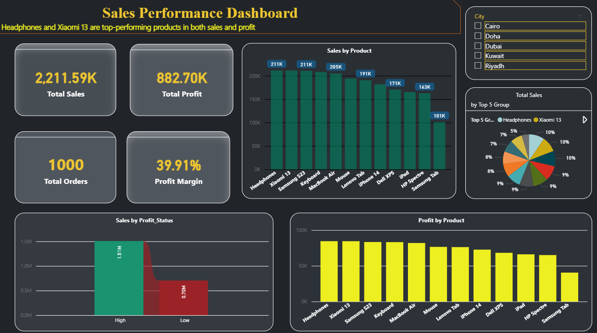

# 📊 Sales Analysis Dashboard

## 🚀 Overview

This project analyzes sales performance across products and cities to uncover key business insights and support data-driven decision-making.

---

## 📊 Dashboard Preview

---

## 🎯 Objective

The goal of this project is to identify opportunities to improve profitability, optimize product strategy, and enhance overall business performance.

---

## 🛠 Tools & Technologies

* Power BI (Dashboard & Visualization)
* Python (Pandas, NumPy)
* Excel (Data Preparation)
* DAX (Calculations)

---

## 🔍 Key Analysis

* Data Cleaning & Preprocessing
* Profit & Profit Margin Analysis
* Top & Underperforming Products
* City Performance Analysis
* Sales Trend Analysis

---

## 💡 Key Insights

### 🟢 Top Performing Products

* Headphones and Xiaomi 13 are top-performing products in both sales and profit
* Indicates strong demand and effective pricing strategy

### 🔴 Underperforming Products

* Some products generate lower profit despite strong sales
* Suggests inefficiencies in pricing or high costs

### 🔵 Market Performance

* Certain cities outperform others, highlighting expansion opportunities

---

## 🎯 Business Recommendations

* Focus on high-margin products to maximize profitability
* Re-evaluate pricing strategy for low-profit items
* Expand in high-performing markets
* Apply cross-selling and bundling strategies

---

## 📁 Project Files

* `sales_analysis.ipynb` → Full analysis
* `Final_Report.xlsx` → Dashboard & report

---

## 📈 Business Impact

This analysis helps:

* Identify profit drivers
* Detect underperforming products
* Optimize pricing strategies
* Improve overall business performance

---

## 📌 Conclusion

This project demonstrates how raw data can be transformed into actionable insights that drive better business decisions.

